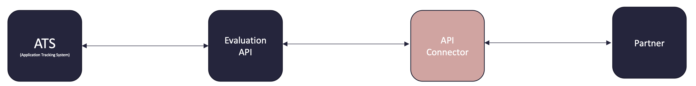
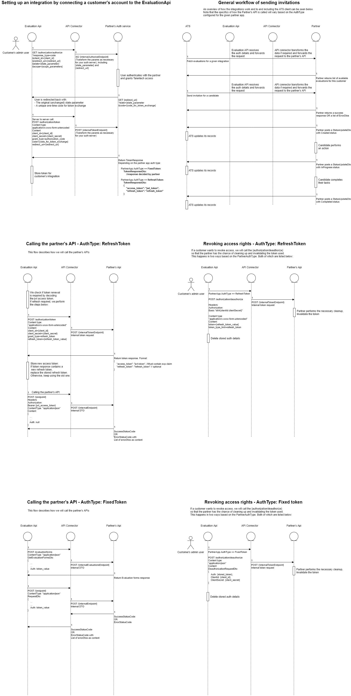

# Introduction
This repository contains a sample implementation for an API Connector for the Talentech Evaluation API using ASP.NET Core. Run the project locally in order to view OpenAPI docs, which are served at the default route.

The API Connector is the component that connects your API with the Talentech ATSes via the Talentech Evaluation API as shown in the high level illustration below.



Key terms
----------
- Evaluation API - The Talentech app partners will integrate with
- Partner App - The existing app managed by the partner.
- API Connector - A facade API controlled by the Partner. This is what will connect the Evaluation API and the Partner App's APIs. 
- Invitations - An invitation for a candidate. This will be sent from the Evaluation API to the API connector
- Results - Results after a candidate has completed an assessment test or reference check. This will be posted from the API connector and back to the Evaluation API
- ApiBaseUrl - The base url of the Api Connector. This is used to resolve the endpoints the Evaluation API expects the API connector to make available.

# What is needed to integrate
The endpoints below must be implemented by a partner in order to integrate with the Talentech Evaluation API. 
- Invitations endpoint
- Health check endpoint
- Evaluations endpoint
- Authorization endpoints (See the OAuth section below)

The relative URLs implemented by the partners can be found here:
https://github.com/Talentech/EvaluationApiSampleIntegration/blob/master/src/Config/Constants.cs

The partner should post results back to the EvaluationApi. In order to do this, an access token must be retrieved from a token server managed by Talentech. This token should be included in the authorization header with the api call to the EvaluationApi. A sample implementation of how this can be done in dotnet core can be found here:
https://github.com/Talentech/EvaluationApiSampleIntegration/blob/master/src/Services/Clients/EvaluationApi/EvaluationApiClient.cs

# OAuth
The OAuth2.0 authorization_code grant is supported by the Evaluation API and is a mandatory requirement for partners who wish to integrate. 

The Api connector should implement the following endpoints in the API connector:
- AuthorizationEndpoint 
- TokenEndpoint
- DeauthorizationEndpoint

These will typically be simple proxy endpoints that route the request on to a backend OAuth service managed by the partner. 

The workflow for granting the Evaluation API access to the PartnerApp's resources works as follows:

- When an ATS customer subscribes to a partner integration, we will need to get their authorization details in order to access their data in the Partner's API on their behalf. 
- This is done by redirecting an admin user from the customer to the Authorization endpoint (which is managed by the Partner).
- At the authorization endpoint, the customer's user will authenticate themselves, as well as grant the Talentech app the required permissions.
- Once done, the user must be redirected back to the EvaluationApi's redirect_uri. An authorization code should be included as a query string parameter.
- When the user hits the Evaluation API's redirect_uri endpoint, an API call will be made to exchange the authorization code for a token.

The {evaluation_api_redirect_uri} is a parameter that should be validated by the partner api. The URL is as follows:
https://evaluation.talentech.io/Customers/OAuth/Callback

We currently support the following token types: "Refresh token" and "Fixed token". 
- Refresh tokens are tokens we will use to retrieve new access tokens from the partner if the existing access token is about to expire.
- Fixed tokens are permanent tokens that will be stored and used as-is. An example of this would be an API key. 

Please note that the samples in the repository currently implement the Fixed token mode.

# Error handling
Whenever an API call to the Api connector returns an HTTP error code, the EvaluationApi will try to deserialize the HTTP content to a given format. The error objects have a type parameter. 
- SystemErrors are meant for the Evaluation API to use internally.
- UserErrors may be shown to end users.

# Retry policies
When results are posted back to Talentech by the partner, the Evaluation API will act as a gateway and forward the data to the ATS that sent the invitation. As the API calls may occasionally fail, it's important that the partner implements retry policies to ensure that the customer eventually receives their data. The retry policy should include an exponential backoff to prevent overloading the API.

# Sequence diagrams
Below is a description of the flows we support. The one we'll use for a given partner's app is governed by the token type (Fixed or Refresh token) configured for the app in question.




# Language Support

When using the Evaluation API there are a couple of things to consider when it comes to language support and localization. 

1. You as a partner might provide assessment tests or reference check forms in different languages. You can either choose to have multi-lingual support in a single test/form and describe a list of the supported languages, or you could provide different tests/forms for each language.

2. When an invitation is triggered from an ATS, we will provide information about the preferred language for each candidate.

The business logic for picking the right language when sending the actual invitations to the candidate must be placed in the API Connector.

## Returning language preferences for each evaluation form
When we call the `/evaluationforms` in the partner's API Connector, you as a partner can return all your available assessment tests or reference check forms. Each entry you return, can have an array with supported languages. 

```
[
  {
    "id": "8763f39e-0552-4ea0-b75d-6cba86d03166",
    "name": "My Assessment Test",
    "languages": [
      {
        "name": "English", 
        "languageCode": "en"
      },
      {
        "name": "Norwegian", 
        "languageCode": "nb-NO"
      }      
    ],
    "description": "This is an example assessment test",
    ]
  }
]
```

## Choosing language for candidate invitations
When the ATS triggers an invitation to the API Connector, we include a `preferredLanguage` field for each candidate. This field contains the preferred language in which the candidate would like to receive emails, see UI or any other language specific content. You as a partner need to use this `preferredLanguage` when sending email invitations, picking the right language version of the test/form or any other language related content you might have.

```
{
  "evaluationFormId": "string",
  "preferredLanguage": "string",
  "candidateDetails": {
    "candidateId": "string",
    "firstName": "string",
    "lastName": "string",
    "email": "string",
    "phoneNumber": "string"
  },
  "noteToCandidate": "string",
  "tenantId": "3fa85f64-5717-4562-b3fc-2c963f66afa6",
  "invitationId": "3fa85f64-5717-4562-b3fc-2c963f66afa6",
  "integrationId": "3fa85f64-5717-4562-b3fc-2c963f66afa6",
  "projectId": "string",
  "projectName": "string",
  ...
}
```

## Language codes
The language code format is based on [RFC 4646](https://datatracker.ietf.org/doc/html/rfc4646) and is a combination of an ISO 639 two-letter lowercase culture code associated with a language and an ISO 3166 two-letter uppercase subculture code associated with a country or region. The language code can be specified using only the language code and not an associated region specifier. If you are using a different format on your language codes, you need to handle the mapping between our codes and your codes in the API Connector.

Examples: nb-NO, en, en-US, en-GB

## Supported languages in Talentech
|Language|Code|Talent Recruiter|ReachMee|Webcruiter|
---------|----|----------------|--------|----------|
|English|en|x|x| |
|Norwegian|no|x|x| |
|Norwegian, bokmål|nb-NO|x|x| |
|Norwegian, nynorsk|nn-NO|x|x| |
|Swedish|sv|x|x| |
|Swedish|sv-SE|x|x| |
|Danish|da|x|x| |
|Danish, Denmark|da-DK|x|x| |
