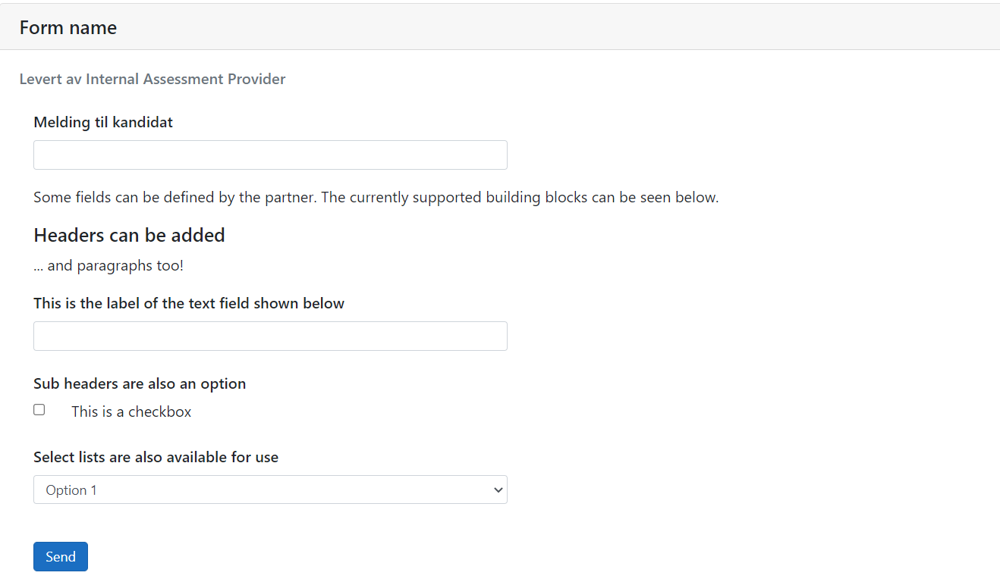

# Evaluation API custom fields
The Evaluation API endpoint `/v1/EvaluationForms` allows partners to describe custom fields we can render in the ATS.

Currently we support the following types of custom fields:
- [Select list](#select-list)
- [Checkbox](#checkbox)
- [Text input](#text-input)
- [Paragraph](#paragraph)
- [Header](#header)
- [Subheader](#subheader)

Both types are added in the array named `CustomFields` on the `EvaluationForm` structure described in the OpenAPI-specification.

All custom fields share the following properties:
- `id`, unique identifier for the custom field.
- `disabled`, indicating whether to render the custom field or not.
- `label`, the display label rendered for the custom field.
- `type`, used to aid in serialization of the supported types of custom field.

In addition to these there are type-specific properties.

The array of custom fields is _ordered_, that means that the content is displayed in order of its index, and this allows creating sections and subsections of content. See the [full example](#full-example).

## Select list
The select list is well suited for showing single choices in the ATS.
o
It contains a single extra property, `options`, an array consisting of `Option`s. An `Option` has an `id` property and a `label` property used for the same purposes as described above.

The type property should have the value `"select"`.

```jsonc
{
    "id": "unique-string-id-for-custom-select-list",
    "disabled": false,
    "label": "Display label for select list",
    "type": "select",
    "options": [
        {
            "id": "unique-string-id-for-option",
            "label": "Display label for option"
        }
    ]
}
```

## Checkbox
Checkboxes are well suited for providing additional "multiple choice" inputs to the evaluation form.

A checkbox should contain a single extra property, `value`, a boolean where `true` represents the checkbox being checked, and `false` represents it being unchecked.

The type property should have the value `"checkbox"`.

```jsonc
{
    "id": "unique-string-id-for-custom-checkbox",
    "disabled": false,
    "label": "Display label for checkbox",
    "type": "checkbox",
    "value": true
}
```
## Text input
Text inputs are suited for comments (responses, names of things, feedback).

Text inputs contain a single extra property, `value`, a string representing the text entered into the text input.

The `type` property should have the value `"text"`

```jsonc
{
    "id": "unique-string-id-for-custom-text-input",
    "disabled": false,
    "label": "Display label for text input",
    "type": "text",
    "value": "Insightful comment, answer or other kind of textual feedback."
}
```

## Paragraph
Paragraphs are suited for descriptions or explanations.

A paragraph does not contain any extra properties, and its label determines its content.

The `type` property should have the value `"paragraph"`

```jsonc
{
    "id": "unique-string-id-for-custom-paragraph",
    "disabled": false,
    "label": "Incredibly informative and helpful description of something pertaining to the evaluation form.",
    "type": "paragraph"
}
```

## Header
Headers are suited for descriminating between sections of content.

A header does not contain any extra properties, and its label determines its content.

The `type` property should have the value `"header"`.

```jsonc
{
    "id": "unique-string-id-for-custom-header",
    "disabled": false,
    "label": "Best Title",
    "type": "header"
}
```

## Subheader
Subheaders are suited for dividing up content within a section.

A subheader does not contain any extra properties, and its label determines its content.

The `type` property should have the value `"subheader"`.

```jsonc
{
    "id": "unique-string-id-for-custom-subheader",
    "disabled": false,
    "label": "Best Title",
    "type": "subheader"
}
```

## Full example
```jsonc
[
    {
        "id": "id-from-partner-1",
        "name": "Form name",
        "languages": [],
        "description": "string",
        "customFields": [
            {
                "id": "paragraph-1",
                "type": "paragraph",
                "label": "Some fields can be defined by the partner. The currently supported building blocks can be seen below."
            },
            {
                "id": "header-1",
                "type": "header",
                "label": "Headers can be added",
            },
            {
                "id": "paragraph-2",
                "type": "paragraph",
                "label": "... and paragraphs too!"
            },
            {
                "id": "text-input-1",
                "type": "text",
                "disabled": false,
                "label": "This is the label of the text field shown below"
            },
            {
                "id": "subheader-1",
                "type": "subheader",
                "label": "Sub headers are also an option"
            },
            {
                "id": "checkbox-1",
                "type": "checkbox",
                "disabled": false,
                "label": "This is a checkbox",
                "value": false
            }
            {
                "id": "select-1",
                "label": "Select lists are also available for use",
                "disabled": false,
                "type": "select",
                "value": "option-1",
                "options": [
                    {
                        "id": "option-1",
                        "label": "Option 1"
                    },
                    {
                        "id": "option-2",
                        "label": "Option 2"
                    }
                ]
            }
        ]
    }
]
```
will result in the following rendering of the form:

