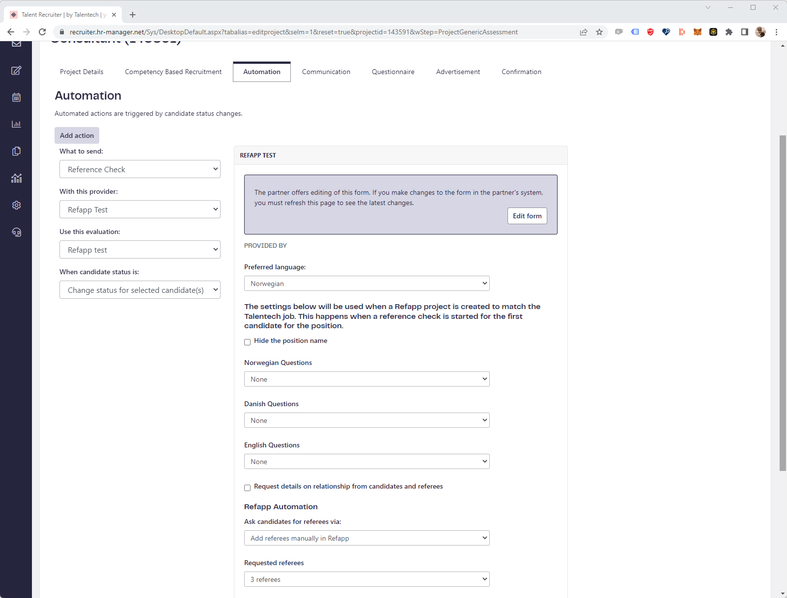

# DRAFT: Recruitment project provisioning

### Introduction
The Talentech Evaluation API is used to offer customers (users) an integrated experience between Talentech's application tracking systems (ATS) and the customer's preferred vendor of reference checks and assessment tests (partner). It offers a two way integration where the recruiter can trigger an invitation to a reference check or assessment test in their ATS and get the results back into the ATS. 

To improve the user experience, it is desired to let the partner be notified about new recruitment projects in the ATS before the first invitation is triggered. It's also desired to let the ATS user easily edit the project specific template by allow the user to navigate from the ATS to the partner UI.


# Suggested solution

## Include project information in initial call to partner

To allow partners to provision projects before the first invitation is sent, they need to know about the recruitment project from the ATS. 

The first call the ATS triggers to the partner, is the `https://[partner]/EvaluationForms` endpoint.

By including `sourceSystem`, `projectId` and `projectName` as optional parameters in the body of that request, we enable the partner to create a project on their side and map that to the ATS project.

**Note to partners!** projectIds are only unique within a specific tenant and ATS, so to ensure uniqueness you need to combine `tenantId+sourceSystem+projectId`. 

**Note to ATSes** If/when partners start returning project specific evaluation forms, you __must__ make sure to cache evaluation forms per project and not per tenant. Cache key could be `tenantId+projectId+evaluationFormId`.

### Overall flow


## Required API changes

### Request

**New properties**

|Property|Description|Nullable|
|---|---|---|
|projectId|Send the ATS projectId if the ATS wants to support project specific evaluation forms| Yes |
|projectName|Send the most recent project name every time we call the partner, so that the partner can update the project name on their side if necessary| Yes |
|sourceSystem|Should use the same sourceSystem as used in invitations| |

**Example request**
```
{
  "triggeredBy": {
    "encryptedFields": [
      "string"
    ],
    "email": "string",
    "firstName": "string",
    "lastName": "string"
  },
  "projectId": "string",
  "projectName": "string",
  "sourceSystem": "string"
  "auth": {}
}
```

### Response

**New properties**

|Property|Description|Nullable|
|---|---|---|
|projectId|Indicate the projectId if the form has project specific edits| Yes |
|editUrl|If you as partner allow editing, provide the editUrl as a fully qualified URL here| Yes |

**Example response**

```
[
  {
    "id": "string",
    "name": "string",
    "projectId": "string", 
    "editUrl": "string", 
    "languages": [
      {
        "name": "string",
        "languageCode": "string"
      }
    ],
    "description": "string",
    "customFields": [
      {
        "id": "string",
        "label": "string",
        "type": "string",
        "disabled": true
      }
    ],
    "scoreProfiles": [
      {
        "id": "string",
        "name": "string",
        "description": "string"
      }
    ]
  }
]
```

## Various considerations

### ATS impacts
- Sending projectId is optional
- Make sure to cache Evaluation Forms per project! Always!
- Access control for who can edit forms must be handled in ATS based on the ATS roles. ATS knows nothing about access control on partner side

### Evaluation API


### Partner

- FormEditUrl in Evaluation Form response
- Need to white list hostname so we can validate in Evaluation API


- Optional Talentech ID SSO
- Open in new tab so it can just be closed after editing
- ATS form needs a refresh before changes are reflected
  - caching can be an issue here.. 


## UX suggestions
The suggested improvement will give the end user the possibility to modify templates (Evaluation Forms) in the partner's system in an easier way by offering navigation directly from the ATS to the partner's administration UI.

Below are suggestions on how this can look in Talentech's three ATSes, ReachMee, Talent Recruiter and Webcruiter.

### Flow
1. The recruiter creates a new recruitment project in the ATS
2. The recruiter selects that the recruitment project project should use an assessment test or a reference check.
3. The recruiter selects a preferred partner.
4. The partner gets the request for available evaluation forms along with information about the source system (ATS) and the projectId and returns the relevant evaluation forms along with EditUrls for the forms they allow the recruiter to edit.
5. The ATS can choose to display an edit button where they link to the provided EditUrl for each particular evaluation form. This should only be shown to the relevant users. This needs to be enforced by the ATS.
6. If the recruiter clicks the edit button for a particular evaluation form, a new tab is opened and the user can continue in the partner's system.
7. When editing is done, the user can close the tab and get back to the ATS. The user needs to refresh the form in the ATS to get the most recent changes.





